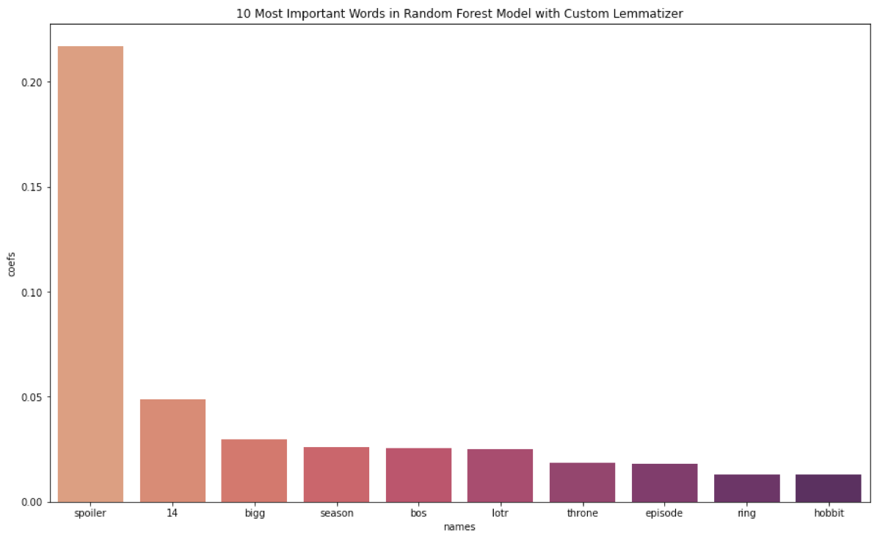

## NLP Modelling of Two Reddit Pages

### Table of Contents
Below is a table of contents, which contains the file name, file order, and file description. The file order column represents which order the files should be opened and read. Folder Order 0 and File Order 1 should be started with.

**Folder Name**|**Folder Order**|**File Name**|**File Order**|**File Description**
:-----:|:-----:|:-----:|:-----:|:-----:
Main|0|README.md|1|The README file contains the executive summary and overview of the project as a whole.
Main|0|NLP_Project_Presentation.ppt|2|This is the ppt version of the project presentation.
Main|0|NLP_Project_Presentation.pdf|3|This is the pdf version of the project presentation.
data|1|got_5100_posts.csv|1|These are the raw Game of Thrones subreddit posts.
data|1|lotr_5100_posts.csv|2|These are the raw Lord of the Rings subreddit posts.
data|1|combined_data_with_selftext.csv|3|This is the combined, cleaned dataset from both subreddits.
data|1|combined_data_cleaned_with_regexp.csv|4|This is the final, cleaned dataset used for modelling.
code|2|01_Webscraping.ipynb|1|In this notebook I gather the raw data from Reddit.
code|2|02_EDA_and_Cleaning.ipynb|2|In this notebook I clean and perform Exploratory Data Analysis on the data.
code|2|03_Naive_Bayes_Modelling_Part1.ipynb|3|This notebook contains the initial Naive Bayes models for the project.
code|2|04_Naive_Bayes_Modelling_Part2.ipynb|4|This notebook contains the final Naive Bayes models for the project.
code|2|05_Random_Forest_Modelling.ipynb|5|This notebook contains the Random Forest models for the project.
images|3|Top_Words_in_RFC_Model.png|1|This image contains the top words used in the production Random Forest Model.

**The Problem**

Reddit.com is a social media website where one can find a community on almost any topic. Each topic is referred to as a "subreddit" and denoted by "r/topic_name" and these subreddits have moderators that provide guidance and rules for content that belongs on the page and content that does not. I have a friend who is the main subreddit moderator for the r/GameofThrones webpage, and she often runs into the problem where she has to spend time manually removing posts related to the Lord of the Rings on her subreddit page. She spends hours every week on this problem, so I thought I might try to help her out.

**The Solution**

To help this friend out, I thought I would try to help by creating a classification model that can delineate between Game of the Thrones-related posts and those that should belong on the r/LordoftheRings (r/LOTR) subreddit page instead. My friend could then use the model to help filter out the Lord of the Rings posts from the r/GameofThrones webpage. In summary, I utilized Naive Bayes and Random Forest Classifier models to develop the best classification model that optimizes for accuracy score, Sensitivity/Recall score, and reduces the false negative predictions as much as possible.

**Evaluation Metrics**
In order to evaluate for the best classification model, I decided to optimize for both Accuracy Score and Recall/Sensitivity. The dataset was split fairly evenly between the two subreddit pages, so the null model to compare to was ~50%. Accuracy score helped me evaluate how the models did on the training set vs the test set (as well as keep an eye on overfitting), and the Recall/Sensitivity score allowed me to optimize for retainment of the Game of Thrones posts. I figured it would be better for her to allow in a small amount of Lord of the Rings posts rather than discard legitimate Game of Thrones posts.

**Data Acquisition and Preprocessing**

To gather data, I use Pushshift's Reddit API to scrape 5,100 post titles and descriptions from each page and put them into a dataframe. I did some cleaning and EDA on each and ultimately decided not to use the post descriptions in my model because there were so many null values between the two datasets. Once I combined my datasets into one large dataframe, I explored using a RegEx Tokenizer to filter out the emojis, special characters, and symbols. Notebook 01 contains the data collection phase of my project and Notebook 02 contains the EDA and Cleaning phases of my project.

**Final Production Model**

After the EDA and cleaning phase, I then began to build some models. I tested both the Multinomial Naive Bayes Classifier and the Random Forest Classifier models to explore which would work best with this dataset. I ran about 20 models between the two types of models, and those can be found in Notebooks 03, 04, and 05. I found that both types of models performed similarly overall, but the best model was a Random Forest Classifier because it had the lowest Recall/Sensitivity score and lowest False Negative score. The Random Forest Model also was able to maintain the least amount of overfitting. This best model utilized a TFIDF Vectorizer and WordNet Lemmatizer to further prep the data. The test score accuracy was 93% and Recall/Sensitivity score was 91%.

In examining the most important words in the Random Forest Model, I discovered that some words made sense, but others did not. Upon further investigation, it was discovered that many of the posts in my r/GameofThrones dataset were actually spam for other common shows (outside of Lord of the Rings). This explains why words such as "14", "bigg", and "bos" were among the top words. There were many spam posts about MTV India's "Bigg Boss" show in the dataset. I have added this to the further work section of this project to go back and make a custom stop words list to remove those types of things. While I'm at it, I'd like to remove the word "spoiler" from the dataset as well. I think these improvements may enhance the performance of my model overall.

**The Conclusion**

After running many models and tuning parameters, I found that I was able to create a successful model that can help my friend with ~93% accuracy and ~9-10% of the predictions coming up as false negatives. This model was a Random Forest Classifier that utilized a Tfidf Vectorizer and WordNetLemmatizer. This best model can be found in Notebook 05.

**Recommendations**

As with many Data Science endeavors, the creation of a successful model depended heavily on the data cleaning phase of this project. While my model was able to discern between the two subreddit posts with ~93% accuracy, I found that the best model utilized the TFIDF Vectorizer (as opposed to the CountVectorizer) and WordNet Lemmatizer together, along with removing stopwords and utilizing the max_features hyperparameter. The RandomForest Classifier performed better than Naive Bayes in this work, outperforming not so much in accuracy score but in the Recall/Sensitivity metric and in reducing overfitting.

**Improvements**

While I was able to create a successful production model that can discern between the two subreddits, there is plenty of follow-up work to progress and further refine the model's performance. As mentioned, I'd like to go back and add more words to the stopwords list to remove the spam posts. I'd also like to experiment with different types of classification models to see if I can improve performance. It may also be interesting to utilize a Sentiment Analysis type of tool, as the Game of Thrones seasons were often controversial, and I wonder if the sentiment of the posts might be useful for the models.
